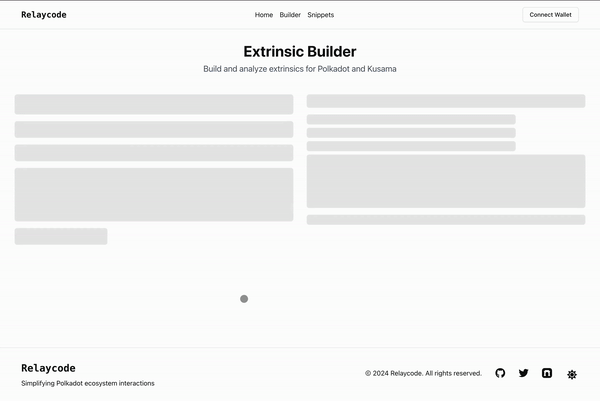

# Relaycode: Rethinking Extrinsics in Polkadot

## Project Overview
Relaycode is an intuitive extrinsics builder designed to transform the way developers and users interact with extrinsics in the Polkadot ecosystem. By bridging the gap between complex pallet operations and user-friendly interfaces, Relaycode gives both regular users and developers the ability to harness the full potential of extrinsics the Polkadot ecosystem.

### Key Features:

1. **A New Extrinsic Builder**: Our state-of-the-art builder allows users to construct extrinsics with ease, providing real-time encoding and decoding for immediate visual feedback.

2. **Dual-Pane Interface**: Relaycode lets you see the best of both worlds with our split-view design. Build extrinsics using human-readable inputs on one side, while simultaneously viewing the corresponding encoded data on the other.

3. **Bi-Directional Editing**: Seamlessly switch between editing human-readable values and raw encoded data. Changes in one pane are instantly reflected in the other, offering unparalleled flexibility.

4. **Wallet Integration**: Connect your Polkadot wallet directly within Relaycode to sign and submit extrinsics, eliminating the need for external tools or interfaces.

5. **Customizable Snippets**: Create, save, and share reusable extrinsic templates. Streamline complex processes by chaining multiple calls into a single, user-friendly form.

6. **Educational Tools**: Built-in guides and tooltips help users understand the intricacies of extrinsics, making Relaycode an excellent learning platform for Polkadot users.

## Technical Architecture
- Frontend: Next.js 15 with App Router, React, TypeScript
- Styling: Tailwind CSS, shadcn/ui components
- State Management: React Hooks, Context API
- Polkadot Integration: [Dedot](https://github.com/dedotdev/dedot)
- Theming: next-themes for dark/light mode support

## Milestones

For detailed project milestones and deliverables, see our [Milestones](docs/relaycode.md) documentation.

### List of components for Extrinsic Inputs (WIP)

This is a list of input components that are going to be implemented for the extrinsic builder. This list is currently based on `polkadot-js` components found [here](https://github.com/polkadot-js/apps/tree/master/packages/react-params/src/Param). 

- [ ] **Account** - Handles `AccountId`, `Address`, `LookupSource`, `MultiAddress`
- [ ] **Amount** - Handles `AccountIndex`, `i8`, `i16`, `i32`, `i64`, `i128`, `u8`, `u16`, `u32`, `u64`, `u128`, `u256`
- [ ] **Balance** - Handles `Amount`, `Balance`, `BalanceOf`
- [ ] **Bool** - Handles `bool`
- [ ] **Bytes** - Handles `Bytes`, `Vec<u8>`
- [ ] **Call** - Handles `Call`, `Proposal`, `RuntimeCall`
- [ ] **Cid** - Handles `PalletAllianceCid`
- [ ] **Code** - Handles `Code`
- [ ] **DispatchError** - Handles `DispatchError`
- [ ] **DispatchResult** - Handles `DispatchResult`, `Result<Null, SpRuntimeDispatchError>`
- [ ] **Raw** - Handles `Raw`, `RuntimeSessionKeys`, `Keys`
- [ ] **Enum** - Handles `Enum`
- [ ] **Hash256** - Handles `Hash`, `H256`
- [ ] **Hash160** - Handles `H160`
- [ ] **Hash512** - Handles `H512`
- [ ] **KeyValue** - Handles `KeyValue`
- [ ] **KeyValueArray** - Handles `Vec<KeyValue>`
- [ ] **Moment** - Handles `Moment`, `MomentOf`
- [ ] **Null** - Handles `Null`
- [ ] **OpaqueCall** - Handles `OpaqueCall`
- [ ] **Option** - Handles `Option`
- [ ] **Text** - Handles `String`, `Text`
- [ ] **Struct** - Handles `Struct`
- [ ] **Tuple** - Handles `Tuple`
- [ ] **BTreeMap** - Handles `BTreeMap`
- [ ] **Vector** - Handles `Vec`, `BTreeSet`
- [ ] **VectorFixed** - Handles `VecFixed`
- [ ] **Vote** - Handles `Vote`
- [ ] **VoteThreshold** - Handles `VoteThreshold`
- [ ] **Unknown** - Handles `Unknown`
