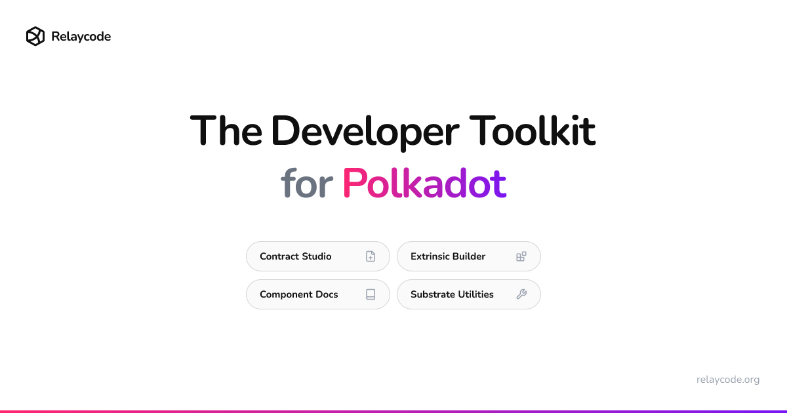
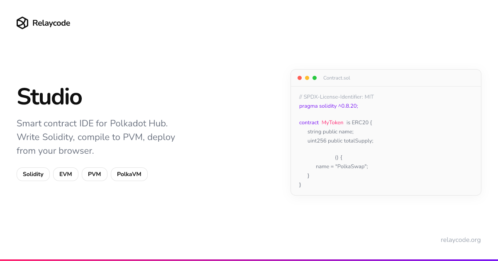
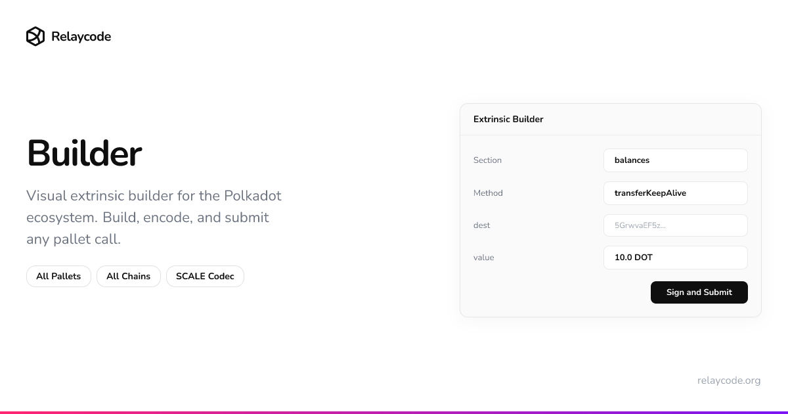

# Relaycode

[](https://github.com/itsyogesh/relaycode/actions/workflows/ci.yml)
[](https://codecov.io/gh/itsyogesh/relaycode)
[](https://opensource.org/licenses/Apache-2.0)
[](https://www.typescriptlang.org/)
[](https://grants.web3.foundation/)

The developer toolkit for Polkadot. Build extrinsics, write smart contracts, and interact with Substrate chains — all from your browser.

<p align="center">
  
</p>

## Tools

### Contract Studio



Browser-based smart contract IDE for Polkadot Hub. Write Solidity, compile to EVM or PVM (PolkaVM), and deploy with native Polkadot wallets. No CLI, no MetaMask, no fragmented toolchain.

**[relaycode.org/studio](https://relaycode.org/studio)**

### Extrinsic Builder



Visual extrinsic builder for the Polkadot ecosystem. Build, encode, decode, and submit any Substrate extrinsic with a dual-pane interface. Supports all pallets across all chains.

**[relaycode.org/builder](https://relaycode.org/builder)**

### Component Docs

Documentation for input components, encoding/decoding APIs, and usage guides. Built with Fumadocs.

**[relaycode.org/docs](https://relaycode.org/docs)**

### Substrate Utilities *(planned)*

SS58, EVM, and hex address converter plus other Substrate utilities.

## Tech Stack

| Layer | Technology |
|-------|-----------|
| **Framework** | Next.js 15 (App Router) |
| **Language** | TypeScript (strict mode) |
| **Styling** | Tailwind CSS + shadcn/ui |
| **Polkadot Client** | [Dedot](https://github.com/dedotdev/dedot) |
| **Wallet** | [LunoKit](https://github.com/nickytonline/luno-kit) (Polkadot.js, Talisman, SubWallet) |
| **Smart Contracts** | Solidity → EVM / PVM via PolkaVM |
| **Docs** | [Fumadocs](https://fumadocs.vercel.app/) |
| **Testing** | Jest + React Testing Library |
| **Deployment** | Vercel (Edge + Serverless) |
| **Package Manager** | Yarn 1.x |

### Supported Chains

Polkadot, Kusama, Westend, Paseo, Asset Hubs, People chains, Coretime chains.

## Getting Started

### Prerequisites

- Node.js 18+
- Yarn 1.x (`npm install -g yarn`)

### Setup

```bash
# Clone the repository
git clone https://github.com/itsyogesh/relaycode.git
cd relaycode

# Install dependencies
yarn install

# Start the development server
yarn dev
```

Open [http://localhost:3000](http://localhost:3000) in your browser.

### Environment Variables

Copy the example and configure:

```bash
cp .env.example .env
```

| Variable | Description | Default |
|----------|------------|---------|
| `NEXT_PUBLIC_APP_URL` | Application URL | `http://localhost:3000` |
| `NEXT_PUBLIC_DEFAULT_CHAIN` | Default chain identifier | `pop-network-testnet` |
| `NEXT_PUBLIC_SUPPORTED_CHAINS` | JSON array of supported chains | See `.env` |

### Available Commands

| Command | Description |
|---------|------------|
| `yarn dev` | Start development server |
| `yarn build` | Production build |
| `yarn start` | Start production server |
| `yarn lint` | Run ESLint |
| `yarn test` | Run Jest tests |
| `yarn test:watch` | Run tests in watch mode |

## Project Structure

```
app/
  (marketing)/          # Landing pages
  builder/              # Extrinsic builder
  studio/               # Contract Studio IDE
  docs/                 # Documentation (Fumadocs)
  api/
    og/                 # Dynamic OG image generation
    compile/            # Solidity compilation endpoint
components/
  builder/              # Extrinsic builder components
  studio/               # Contract Studio components
  params/inputs/        # Substrate type input components
  ui/                   # shadcn/ui base components
context/                # React context providers
hooks/                  # Custom React hooks
lib/                    # Utility libraries
types/                  # TypeScript type definitions
```

### Input Components

The extrinsic builder includes type-aware input components for every Substrate type:

Account, Amount, Balance, Bool, BTreeMap, BTreeSet, Bytes, Call, Enum, Hash (H160/H256/H512), KeyValue, Moment, Option, Struct, Text, Tuple, Vector, VectorFixed, Vote, VoteThreshold.

Each component maps directly to SCALE-encoded Substrate types and supports validation, encoding, and real-time feedback.

## Deployment

Relaycode is deployed on Vercel. Pushes to `master` trigger automatic production deployments.

OG images are generated dynamically at the edge via `next/og` ImageResponse routes:

- `/api/og/home` — Homepage
- `/api/og/studio` — Contract Studio
- `/api/og/builder` — Extrinsic Builder
- `/api/og/docs` — Documentation

## Contributing

1. Fork the repository
2. Create a feature branch (`git checkout -b feat/my-feature`)
3. Commit your changes
4. Push to the branch (`git push origin feat/my-feature`)
5. Open a Pull Request

## License

[Apache 2.0](LICENSE)

## Acknowledgments

Funded by a [Web3 Foundation](https://web3.foundation/) grant. Built with [Dedot](https://github.com/dedotdev/dedot) and [LunoKit](https://github.com/nickytonline/luno-kit).
